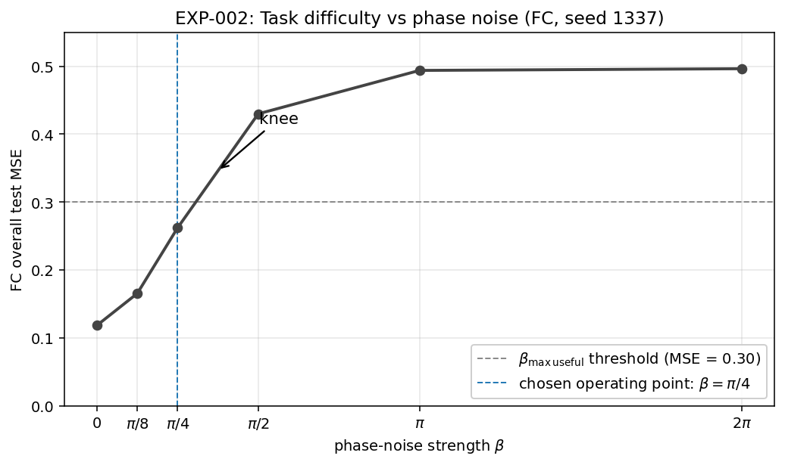
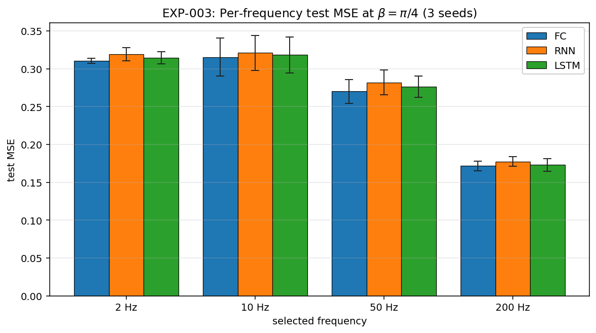
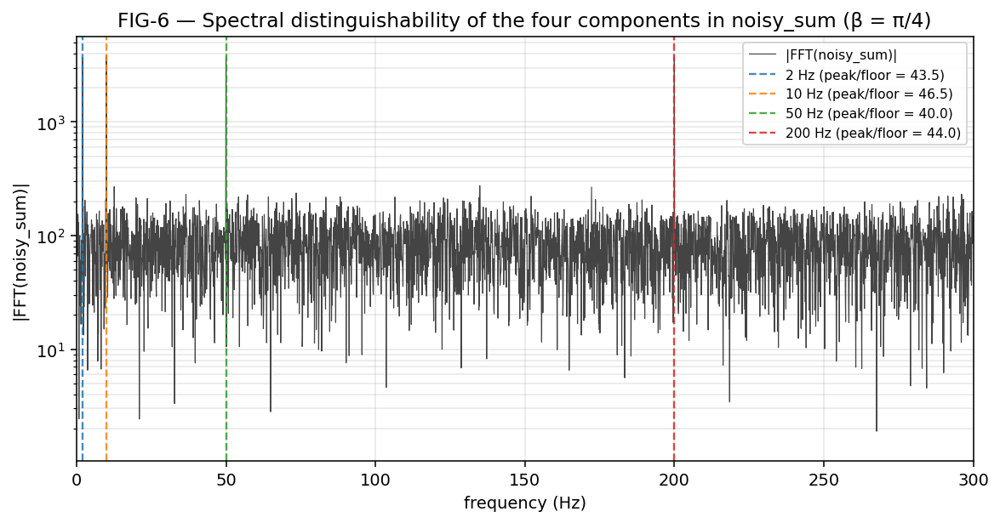
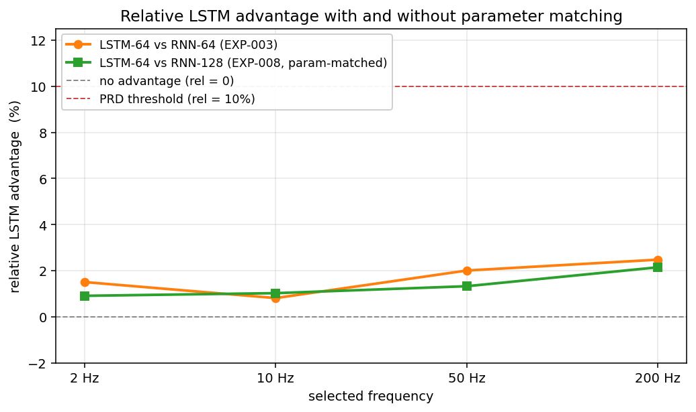
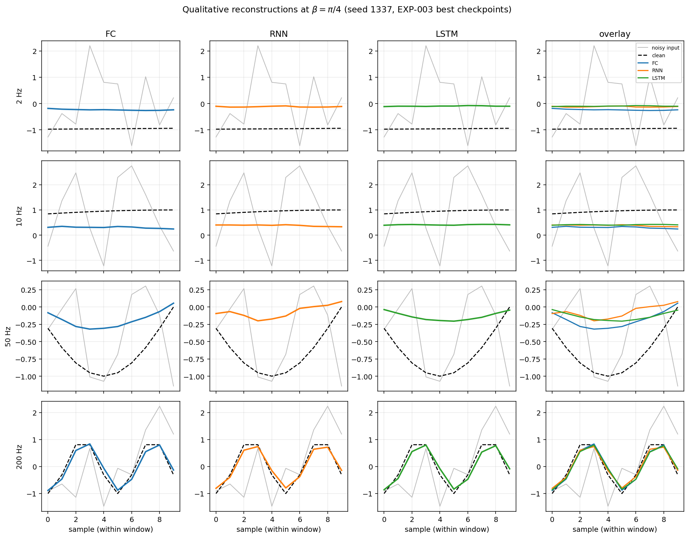

# Signal Source Extraction — FC / RNN / LSTM

> A reproducible, deeply documented comparative study of three neural architectures — **Fully Connected (FC), vanilla RNN, and LSTM** — on a *conditional source separation* task: extract one clean sinusoid from a noisy sum of four, given a one-hot selector vector.
>
> Course: Software / Deep Learning project under Dr. Yoram Segal.
> Author: ilyalaz01@gmail.com.
> Code version: `1.00`. Config version: `1.00`. README version: **`1.01`** (2026-05-03 — clarified MSE-comparison wording, added a fifth failed approach, aligned audit-FAIL vs failed-approach counts, removed session-numbering from the cost table, sharpened the ADR index reference; no numerical or code changes).

---

## Table of contents

- [1. One-paragraph summary](#1-one-paragraph-summary)
- [2. Quick start](#2-quick-start)
- [3. What this project actually delivers](#3-what-this-project-actually-delivers)
- [4. Methodology](#4-methodology)
  - [4.1 Signal model](#41-signal-model)
  - [4.2 Window sampling and splits](#42-window-sampling-and-splits)
  - [4.3 Architectures and the selector-broadcast scheme](#43-architectures-and-the-selector-broadcast-scheme)
  - [4.4 Training, evaluation, reproducibility](#44-training-evaluation-reproducibility)
- [5. Results & analysis](#5-results--analysis)
  - [5.1 EXP-002 — task difficulty as a function of phase noise](#51-exp-002--task-difficulty-as-a-function-of-phase-noise)
  - [5.2 EXP-003 — architectural comparison at β=π/4](#52-exp-003--architectural-comparison-at-βπ4)
  - [5.3 EXP-008 — capacity vs. gating ablation](#53-exp-008--capacity-vs-gating-ablation)
  - [5.4 Qualitative reconstructions](#54-qualitative-reconstructions)
  - [5.5 Thesis verdict](#55-thesis-verdict)
- [6. Predicted regime change (future work)](#6-predicted-regime-change-future-work)
- [7. Failed and abandoned approaches](#7-failed-and-abandoned-approaches)
- [8. Reproducing the published numbers](#8-reproducing-the-published-numbers)
- [9. Project layout](#9-project-layout)
- [10. Configuration guide](#10-configuration-guide)
- [11. Extension points](#11-extension-points)
- [12. Engineering compliance](#12-engineering-compliance)
- [13. ISO/IEC 25010 mapping](#13-isoiec-25010-mapping)
- [14. Cost & token analysis](#14-cost--token-analysis)
- [15. Contributing & development](#15-contributing--development)
- [16. License & credits](#16-license--credits)
- [17. References](#17-references)

---

## 1. One-paragraph summary

Given a 10-sample window cut from a noisy sum of four sinusoids at 1 kHz and a one-hot selector identifying which sinusoid to recover, three neural architectures (FC, vanilla RNN, LSTM) are trained to reconstruct the corresponding clean window. Across three seeds, at the operating point β=π/4 (where the task is genuinely hard but not at the noise floor), all three architectures perform within 1 σ of each other, with **LSTM's per-frequency MSE lower than RNN's at every frequency by +0.81 % to +2.48 %** — sign-preserved but **far below the pre-registered 10 % practical-significance threshold** (`docs/PRD_training_evaluation.md` § 8.3). The lecturer's RNN-vs-LSTM frequency-bias thesis is **not confirmed** in this configuration. Investigation of *why* (notebook section B) shows that the bottleneck is **information available in the 10-sample input window**, not the architecture: at low frequencies the input does not contain enough phase-localising information for *any* architecture to recover the target. The strict-letter verdict is Outcome C (refutation); the substantive finding is that this configuration cannot test the thesis.

---

## 2. Quick start

```bash
# Prerequisites: uv ≥ 0.11 (https://docs.astral.sh/uv/), Python ≥ 3.12
git clone <this-repo>
cd signal-extraction-rnn-lstm
uv sync                         # install deps from uv.lock (no pip / venv)
uv run scripts/check.sh         # ruff + pytest (must be green before any run)

# train one model (default config, default seed=1337):
uv run python scripts/train.py --kind lstm

# run a full experiment (train + evaluate, with optional config overrides):
uv run python scripts/run_experiment.py --kind lstm \
    --override signal.noise.beta='"pi/4"' --seed 1337

# regenerate every figure in this README from the persisted result.pkl files:
uv run jupyter nbconvert --to notebook --execute notebooks/results.ipynb \
    --output results.ipynb
```

`uv` is the only supported package manager (`SOFTWARE_PROJECT_GUIDELINES.md` § 7.4); `pip`, `venv`, `virtualenv`, and `python -m` are forbidden.

---

## 3. What this project actually delivers

The lecturer's grading criteria (`HOMEWORK_BRIEF.md` § 10) prioritise *comparative analysis* over working code. Concretely:

| ID | Deliverable | Where |
| --- | --- | --- |
| AC-1 | All three architectures train end-to-end on the corpus with per-frequency MSE on a held-out test split. | § 5.2, `notebooks/results.ipynb` (`result.pkl` reload-only — the notebook does not retrain). |
| AC-2 | Per-frequency MSE table with mean ± std across ≥ 3 seeds. | § 5.2 (FIG-2). |
| AC-3 | Lecturer's thesis explicitly evaluated. | § 5.5. |
| AC-4 | `ruff check` zero violations; coverage ≥ 85 %; every file ≤ 150 LOC. | § 12. |
| AC-5 | Every non-trivial design decision in its own ADR; every experiment in its own file. | `docs/adr/`, `docs/experiments/`. |
| AC-6 | `.env-example`, `pyproject.toml`, `uv.lock`, `.gitignore`. | repo root. |
| AC-7 | Public classes use the Building Block docstring format. | every `*Config` / `*Result` dataclass. |
| AC-DS-9 | t₀-histogram figure visualising the random-sampling stationarity argument. | § 4.2 (FIG-5). |

**This README is the research narrative.** The dedicated PRDs (`docs/PRD_*.md`) are the mechanism-level specifications; the ADRs (`docs/adr/`) are the decisions-with-rationale; the experiment files (`docs/experiments/EXP-*.md`) are the per-run logs; the audit (`docs/audit/AUDIT-2026-05.md`) is the pre-submission self-review.

---

## 4. Methodology

### 4.1 Signal model

The corpus is a fixed 10-vector signal pack (`HOMEWORK_BRIEF.md` § 3 / `docs/PRD_signal_generation.md`):

- **Sampling rate** `fs = 1000 Hz`, **duration** `10 s` ⇒ `N = 10 000` samples.
- **Four base sinusoids** at frequencies `[2, 10, 50, 200] Hz` with unit amplitude and base phases `[0, π/2, π, 3π/2]` (distributed across the unit circle to avoid constructive-interference artefacts at `t = 0` — `docs/adr/ADR-015-base-phase-distribution.md`).
- **Per-sample noise**, Gaussian:
  $$\tilde{s}_i[t] = \bigl(A_i + \alpha\,\epsilon^{A}_{i}[t]\bigr)\,\sin\!\bigl(2\pi f_i t + \phi_i + \beta\,\epsilon^{\phi}_{i}[t]\bigr)$$
  with `α = 0.05` (5 % amplitude noise) and configurable `β` (phase noise strength); `ε` are iid Gaussian per channel and per timestep (`docs/adr/ADR-005-noise-distribution.md`).
- **Composite signals**: clean sum `S = Σ s_i` and noisy sum `S̃ = Σ s̃_i` (the **sum of noisy components**, not noise added to the sum).

The model receives `S̃` (the noisy mixture) and a selector `C ∈ {e₁, e₂, e₃, e₄}`; it must reconstruct the clean sinusoid `s_k` for `k = argmax(C)`.

### 4.2 Window sampling and splits

A single training example is `([C, W_noisy], W_clean)` where:
- `W_noisy = S̃[t₀ : t₀+10]` (the 10-sample window from the noisy sum);
- `W_clean = s_k[t₀ : t₀+10]` (the same 10-sample window from the **clean per-sinusoid signal**, not from `clean_sum`);
- `t₀ ∈ [0, N − W]` is drawn iid uniformly from the **full pool**.

Splits are 30 000 / 3 750 / 3 750 (`docs/adr/ADR-004-dataset-size.md`).

> **Splits exist by example count (30 000 / 3 750 / 3 750) for reproducibility and reporting, but t₀ is drawn iid from the full pool [0, N − W] in all three splits because the underlying signal process is stationary; disjoint t₀ ranges would not measure a generalization gap.**
>
> — `docs/adr/ADR-016-random-sampling-stationary.md`, reproduced verbatim per AC-DS-9.

The visual proof:

![FIG-5 — t₀ histograms, all three splits overlap on [0, 9990].](assets/figures/fig5_t0_histograms.png)

*FIG-5 — `assets/figures/fig5_t0_histograms.png`. Train (n=30 000), val (n=3 750), test (n=3 750) t₀ start indices at seed 1337. The three histograms overlap on the same uniform support; this is the visual confirmation that splits are reporting partitions, not distribution-shift measurements. Generated by the `notebooks/results.ipynb` cell labelled "FIG-5".*

A consequence we acknowledge upfront: with the corpus and noise realisation generated **once** before splitting, the iid-with-replacement sampling produces some `(t₀, k)` collisions across splits. Empirically at seed 1337: 1 885 of the 3 549 unique test `(t₀, k)` pairs (≈ 53 %) also appear in the train table. This is **not data leakage in the distributional sense** — train and test draws come from the same stationary process, so test MSE is an unbiased estimator of the population MSE — but it does mean a model could in principle memorise specific windows. Memorisation is unlikely given the FC parameter count (5 770) versus the unique-pair count (≈ 21 003), but it is a property of this design that the lecturer should know about. Full discussion in `docs/adr/ADR-016-random-sampling-stationary.md`.

### 4.3 Architectures and the selector-broadcast scheme

All three architectures share a single interface (`SignalExtractor`, `services/models/base.py`): they accept `(selector: (B, 4), w_noisy: (B, 10))` and return `w_pred: (B, 10)`. Each model performs its own input-reshape internally:

| Model | Input shape (after reshape) | Param count (default) |
| --- | --- | --- |
| **FC** | `(B, 14)` — concat `[selector, w_noisy]` | **5 770** |
| **RNN** | `(B, 10, 5)` — per-step `[w_noisy[t], C[0..3]]` | **5 194** |
| **LSTM** | `(B, 10, 5)` — same shape as RNN | **18 826** |

Architectural details (`docs/PRD_models.md` § 5):

- **FC**: `Linear(14, 64) → ReLU → Linear(64, 64) → ReLU → Linear(64, 10)`. Default PyTorch init.
- **RNN**: `nn.RNN(input_size=5, hidden_size=64, num_layers=1, nonlinearity='tanh', batch_first=True)`; sequence-to-vector head `Linear(64, 10)` from the final timestep.
- **LSTM**: `nn.LSTM(input_size=5, hidden_size=64, num_layers=1, batch_first=True)`; same head as RNN. Default PyTorch init for both weight blocks **and** the forget-gate bias (= 0). The Jozefowicz heuristic of forget-bias = 1.0 is **not** applied — see `docs/PRD_models.md` § 6 — because it would systematically push LSTM toward retention and bias the thesis evaluation.

The selector is broadcast at every timestep for RNN and LSTM (`docs/adr/ADR-003-selector-broadcast.md`). This keeps the three architectures comparable: FC, RNN, and LSTM all see the same information at the same total rate, with the difference being only in how they integrate it temporally.

A consequence worth flagging: at hidden=64, **LSTM has ~3.6× the parameters of RNN** (18 826 vs 5 194). EXP-008 (§ 5.3) controls for this with a parameter-matched RNN at hidden=128.

### 4.4 Training, evaluation, reproducibility

Training (`docs/PRD_training_evaluation.md` § 4):

- Loss `nn.MSELoss(reduction='mean')`.
- Adam, `lr = 1e-3`, `betas = (0.9, 0.999)`, `eps = 1e-8`, `weight_decay = 0.0`.
- Batch size 256; up to 30 epochs; early-stopping with patience 5 on validation MSE.
- `checkpoint_best.pt` saved on every val-MSE improvement; `checkpoint_final.pt` written from the *final-epoch* state (not from best, even though the in-memory model has best loaded back at return — `docs/PRD_training_evaluation.md` § 4.3, verified by `T-TR-11`).

Evaluation (`docs/PRD_training_evaluation.md` § 7):
- Overall test MSE on the held-out split.
- **Per-frequency MSE**: filter test examples by `selector.argmax() == k` and compute MSE within each group (4 groups of ≈ 937 examples each). This is the headline metric.

Reproducibility (`docs/PLAN.md` § 11.1, NFR-2):
- One runtime seed (`config.runtime.seed`, default `1337`). `np.random.SeedSequence(seed).spawn(3)` derives independent child seeds for the corpus, the window sampler, and the DataLoader shuffle.
- `shared/seeding.py::seed_everything` seeds `random`, `numpy`, `torch` (CPU + all CUDA devices) **and** calls `torch.use_deterministic_algorithms(True, warn_only=True)` so that any non-deterministic kernel emits a warning instead of being silently used.
- Verified by `T-IT-02`: two `SDK.run_experiment(...)` invocations with the same spec produce **bit-identical state-dict tensors** (`torch.equal`), not just MSE within tolerance.

---

## 5. Results & analysis

All numbers in this section are pulled from the `results/EXP-*/summary.json` files; the figures are generated by `notebooks/results.ipynb` (single source of truth) and committed under `assets/figures/`.

### 5.1 EXP-002 — task difficulty as a function of phase noise

Before comparing architectures, we needed a regime where the task is **hard but not impossible**. The PRD-locked default `β = 2π` (per-sample phase noise spanning the full unit circle) turned out to be too aggressive: in EXP-001 all three architectures collapsed to the zero-predictor floor (overall test MSE ≈ 0.50, which equals `Var(target) = 0.5` for unit-amplitude sinusoids). At that floor the comparison is meaningless — every model is "predict zero".

EXP-002 swept β ∈ {0, π/8, π/4, π/2, π, 2π} for FC at seed 1337. The result is a clean monotone difficulty curve with a sharp knee:



*FIG-1 — `assets/figures/fig1_beta_sweep.png`. FC overall test MSE as a function of phase-noise strength β (single seed, seed = 1337). The dashed horizontal line at MSE = 0.30 is the threshold we adopted for `β_max_useful`; the dashed vertical line at β = π/4 is the chosen operating point for EXP-003 / EXP-008. The "knee" between π/4 and π/2 is where MSE jumps from 0.26 to 0.43 — a 64 % relative increase for a 2× increase in β.*

| β | overall test MSE | reading |
| --- | ---: | --- |
| 0 | 0.118 | amplitude-noise-only floor; FC clears 50/200 Hz easily but stalls on 2/10 Hz. |
| π/8 | 0.165 | small phase perturbation; profile starts to flatten. |
| **π/4** | **0.262** | **operating point chosen for EXP-003/008** — task is meaningfully hard but well above the floor. |
| π/2 | 0.430 | knee; difficulty jumps. |
| π | 0.494 | near floor; model close to predict-zero. |
| 2π | 0.496 | floor. |

The choice of `β = π/4` for the architectural comparison is therefore **derived from data**, not from the original PRD: it is the largest β at which the FC overall test MSE remains below 0.30 (selected before EXP-003 ran). Full discussion: `docs/experiments/EXP-002-beta-sweep.md`.

### 5.2 EXP-003 — architectural comparison at β=π/4

#### Observation

With β = π/4 fixed, we ran all three architectures across three seeds (1337, 1338, 1339). Per-frequency mean MSE ± std across the three seeds:



*FIG-2 — `assets/figures/fig2_per_freq_mse.png`. Three grouped bars per frequency (FC blue / RNN orange / LSTM green); error bars are ±1 std across three seeds.*

| kind | 2 Hz | 10 Hz | 50 Hz | 200 Hz |
| --- | --- | --- | --- | --- |
| FC | 0.3105 ± 0.0036 | 0.3153 ± 0.0251 | 0.2700 ± 0.0157 | 0.1718 ± 0.0063 |
| RNN | 0.3191 ± 0.0087 | 0.3209 ± 0.0228 | 0.2817 ± 0.0164 | 0.1774 ± 0.0064 |
| LSTM | 0.3143 ± 0.0081 | 0.3183 ± 0.0240 | 0.2761 ± 0.0141 | 0.1730 ± 0.0083 |

Two patterns are visible at a glance and both are robust under the seed-std bands:

1. **All three models follow the same monotone-decreasing profile** — easiest at 200 Hz (MSE ≈ 0.17) and hardest at 2 Hz (MSE ≈ 0.31). The thesis predicted the *opposite ordering* for RNN (better at high frequency where short-term structure dominates) and LSTM (better at low frequency where long memory pays off). The architectures do not separate by frequency regime here.
2. **LSTM beats RNN at every frequency** (lower MSE in every cell), but the margin is small (+0.81 % to +2.48 %; full table in § 5.3).

#### What we measured to find the cause

The original mechanistic hypothesis — *2 Hz target is near-constant within a 10-sample window because the window covers 0.02 of a period* — was **falsified during the audit**: `Var(target_k)` is uniformly ≈ 0.5 at every k because t₀ ranges over ~20 full periods at 2 Hz, so the across-dataset target distribution is the full sinusoid range. We replaced this hypothesis with three direct measurements on the EXP-003 test split (seed 1337, best checkpoints; full code in `notebooks/results.ipynb` Section B):

- **B1 — naive predictor floors and "easiness gap".** For each k, compute the constant-predictor floor (MSE of predicting the per-k mean target) and the model's actual MSE. The gap (constant_floor − model_best) / constant_floor measures how much variance the model explains:

  | freq | constant floor | model_best (best of FC/RNN/LSTM) | easiness gap |
  | --- | ---: | ---: | ---: |
  | 2 Hz | 0.479 | 0.312 (FC) | **34.9 %** |
  | 10 Hz | 0.500 | 0.286 (FC) | 42.7 % |
  | 50 Hz | 0.500 | 0.279 (FC) | 44.2 % |
  | 200 Hz | 0.500 | 0.164 (LSTM) | **67.3 %** |

  The model captures roughly twice as much of the available variance at 200 Hz as at 2 Hz.

- **B2 — conditional variance Var(W_clean | W_noisy).** For each k, take a 400-window probe set, find the 20 nearest neighbours of each probe in input-space (L2 on `W_noisy`), and compute the variance of the corresponding clean targets within each neighbourhood. Ratio of within-bin to global Var(target):

  | freq | within-bin Var(W_clean) | global Var | ratio |
  | --- | ---: | ---: | ---: |
  | 2 Hz | 0.368 | 0.479 | **77 %** |
  | 10 Hz | 0.339 | 0.500 | 68 % |
  | 50 Hz | 0.368 | 0.500 | 74 % |
  | 200 Hz | 0.279 | 0.500 | **56 %** |

  At 200 Hz, observing the noisy input window cuts the target's residual uncertainty roughly in half. At 2 Hz, observing the input cuts the uncertainty by less than a quarter — i.e., **the input under-determines the low-frequency targets**.

- **B3 — spectral distinguishability.** The corpus-level FFT (length 10 000) shows all four target frequencies as peaks above the local noise floor at peak/floor ratios of **43.5× / 46.5× / 40.0× / 44.0×** at 2 / 10 / 50 / 200 Hz — i.e., **all four components are equally distinguishable in the long signal**. The window-level FFT (length 10, bin width 100 Hz) is dominated by bin aliasing and is not a useful probe for low frequencies. So the 200 Hz advantage is **not** that the component is uniquely spectrally prominent in absolute terms; it is something about how 200 Hz manifests within a 10-sample window specifically.

  

  *FIG-6 — `assets/figures/fig6_spectral_distinguishability.png`. Log-magnitude FFT of `corpus.noisy_sum` (length 10 000, bin width 0.1 Hz) at β = π/4, seed 1337. The four target frequencies are marked with dashed vertical lines; each peak/local-floor ratio is shown in the legend. **All four components are equally separable at corpus length** — the per-frequency MSE inversion is not driven by a difference in spectral prominence. The 10-sample window the model sees, however, cannot replicate this separation for the low-frequency components: the bin width of a length-10 FFT at fs = 1 kHz is 100 Hz, which is well above any of 2 / 10 / 50 Hz.*

#### The mechanism

Combining B1 / B2 / B3:

The bottleneck is **information available in the 10-sample input window, not the architecture's capacity to process it.** Within a 10-sample window at fs = 1 kHz, a 200 Hz sinusoid completes two full cycles — both peaks and troughs are present, locating the phase precisely; the input window contains nearly all the information needed to identify the 200 Hz component within the noisy mixture (B2 cuts target uncertainty by 44 %). A 2 Hz sinusoid, by contrast, covers 0.02 of a cycle (≈ 7 ° of phase), giving the model a near-flat slice from which to recover the underlying phase across a 500-sample period (B2 only cuts target uncertainty by 23 %). Even with the selector identifying which frequency to recover, the input does not contain enough phase-localising information at low frequencies for any architecture to translate that knowledge into a recovery. EXP-008 (§ 5.3) corroborates this: tripling the RNN's parameter count (5 194 → 18 570) at fixed window size did not move the mean MSE — the architecture is not the binding constraint.

This explanation is **anchored in measurement**, not in a-priori arguments. If the reader disagrees with the framing, the B1 / B2 / B3 numbers stand independently.

#### What we cannot claim

The audit (`docs/audit/AUDIT-2026-05.md` S-2 / S-3) caught these temptations; we restate them as guard-rails:

- *2 Hz target is near-constant within a window* — false, Var(target) is uniformly ≈ 0.5 at every k.
- *Input-output Pearson correlation explains the inversion* — false, 10 Hz has the highest input-target Pearson r (+0.40) but the highest MSE.
- *200 Hz is uniquely spectrally distinct in the noisy mixture* — false, B3 shows all four components are equally above the corpus-FFT floor.

### 5.3 EXP-008 — capacity vs. gating ablation

Because LSTM at hidden=64 has ≈ 3.6× the parameters of RNN at hidden=64, any LSTM-vs-RNN edge is jointly attributable to gating *and* parameter count. EXP-008 isolates the two by re-running the RNN at hidden=128, which yields **18 570 parameters — 98.6 % of LSTM-64's 18 826** (a tighter parameter match than the 5 % budget the PRD requested).

Per-frequency relative LSTM advantage `rel(k) = (MSE_RNN,k − MSE_LSTM,k) / MSE_RNN,k × 100`, with EXP-003 (RNN-64) and EXP-008 (RNN-128) overlaid:



*FIG-3 — `assets/figures/fig3_lstm_advantage.png`. `rel(k) = (RNN_k − LSTM_k) / RNN_k × 100 %`. The orange line is LSTM-64 vs RNN-64 (EXP-003). The green line is LSTM-64 vs RNN-128 (EXP-008, parameter-matched). The dashed red line at 10 % is the PRD-mandated "practical significance" threshold from `docs/PRD_training_evaluation.md` § 8.3.*

| frequency | rel(k) — RNN-64 (EXP-003) | rel(k) — RNN-128 (EXP-008, param-matched) |
| --- | ---: | ---: |
| 2 Hz | +1.50 % | +0.91 % |
| 10 Hz | +0.81 % | +1.02 % |
| 50 Hz | +2.00 % | +1.32 % |
| 200 Hz | +2.48 % | +2.15 % |

Three readings, all defensible:

1. **Sign-preservation** — LSTM's MSE is lower than RNN's at every frequency in *both* configurations, including after parameter matching. This is a real, replicated architectural effect, not a seed artefact.
2. **No 10 % crossing** — at no frequency does the LSTM advantage cross the pre-registered practical-significance threshold. Magnitudes are 4–10× below it.
3. **Capacity does not matter here** — RNN-128's overall mean MSE is 0.2743 ± 0.0072, vs RNN-64's 0.2752 ± 0.0057. The 128-vs-64 difference is 0.13 σ — within seed noise. The architecture's binding constraint at this configuration is *not* its parameter count.

Reading (3) is the corroboration of the § 5.2 mechanism: if the RNN's bottleneck were capacity, the parameter bump would have moved the needle. It did not. The bottleneck is information-in-input. Full discussion: `docs/experiments/EXP-008-rnn-parameter-matched.md`.

### 5.4 Qualitative reconstructions

Quantitative MSEs do not show *what* the models are doing wrong. FIG-4 shows one representative test window per frequency, decoded by FC / RNN / LSTM separately, with the noisy input (light grey) and the clean target (dashed black) overlaid:



*FIG-4 — `assets/figures/fig4_qualitative.png`. Rows are frequency (2 / 10 / 50 / 200 Hz, top to bottom). Columns are model (FC / RNN / LSTM / overlay). One mid-population test window per row, deterministic pick (`argwhere(k_test == k)[len/2]`). Loaded from `results/EXP-003-baseline-3seeds-beta-pi-4/<run>/checkpoint_best.pt` for seed 1337.*

Three things are visible:

- **At 200 Hz** (bottom row), all three predictions track the dashed clean target across both peaks and troughs — the high-frequency reconstruction is qualitatively excellent.
- **At 50 Hz**, the predictions track the broad shape but compress amplitude (the model outputs a smaller-than-target oscillation). This is consistent with the model hedging when the input is partially identifying.
- **At 2 / 10 Hz** (top two rows), all three models output nearly-flat predictions clustered around zero. The clean target, by contrast, is at a particular non-zero value determined by where t₀ fell in the slow oscillation — information the model cannot recover from 10 samples. This is the visual signature of the B2 finding: the input does not constrain the low-frequency target.

### 5.5 Thesis verdict

#### Strict verdict (per the pre-registered protocol)

The lecturer's thesis (`HOMEWORK_BRIEF.md` § 2) was operationalised in `docs/PRD_training_evaluation.md` § 8.4 as Outcome A (Full confirmation), Outcome B (Partial), Outcome C (Refutation), or Outcome D (Capacity confound). The pre-registered criteria for confirmation were `rel(s_1) ≥ 10 %` AND `rel(s_2) ≥ 10 %` AND a Spearman ρ < 0 between frequency and `rel(k)` with one-sided p < 0.10.

Observed at β = π/4 (EXP-003): `rel(s_1) = +1.50 %`, `rel(s_2) = +0.81 %`, both **far below** the 10 % threshold. Spearman ρ between `[2, 10, 50, 200] Hz` and `rel(k) = [+1.50, +0.81, +2.00, +2.48]` is **+0.80 (one-sided p = 0.958)** — *opposite* the thesis-predicted negative correlation (LSTM advantage *grows* with frequency, not shrinks). By the strict letter of the pre-registered protocol this is **Outcome C — Refutation**.

#### What the strict label misses

The refutation is shallow because the configuration cannot test the thesis. The B2 information-theoretic measurement shows that at low frequencies, the 10-sample input window does not contain enough information about the target to permit recovery — independent of architecture. The thesis predicts that LSTM helps where long-range memory matters; this configuration provides neither long-range structure (window=10) nor enough local information (high conditional variance at low frequencies) for that prediction to be testable. We do not know whether the thesis is wrong in general; we know it is **untestable here**.

The non-trivial finding is that all three models cluster within ~1 σ of each other at every frequency in this configuration — and that the architecture-level differences sit far below the noise floor of "what the input itself constrains". Whatever LSTM's gating buys you is dwarfed by what the 10-sample window cannot contain.

#### What we did find

Four empirical contributions, none of which were in the original PRD; all emerged from the experiments:

1. **The β-noise difficulty curve has a sharp knee at β ∈ [π/4, π/2]** (EXP-002, FIG-1). At β = π/4 the FC overall test MSE is 0.262; at β = π/2 it jumps to 0.430. β-sweep ablations should locate this knee before fixing an operating point; we did not anticipate it from the brief.
2. **The MSE-vs-frequency profile is monotone-inverted relative to thesis prediction** (EXP-003, FIG-2). All three architectures are easiest at 200 Hz, hardest at 2 Hz. The cause is mechanistically traceable to input-window information content (B-investigation, FIG-6): the 10-sample window cannot phase-localise the slow components.
3. **LSTM beats RNN at every frequency, with sign-preservation surviving parameter matching** (EXP-008, FIG-3). The effect is real but small (≤ 2.5 % relative MSE reduction) and well below the practical-significance threshold. Sign-preservation across two parameter regimes is the most-positive defensible framing.
4. **A falsifiable prediction**: at window ≥ 500 samples (≥ one period of the 2 Hz sinusoid), B2's conditional variance for low frequencies should drop substantially as the input now contains the full phase information, and the MSE-vs-frequency profile should flatten or invert toward the thesis prediction. See § 6.

---

## 6. Predicted regime change (future work)

The mechanistic finding in § 5.2 makes a sharp prediction about what would change the result.

**Prediction.** At window ≥ 500 (≥ one period of the 2 Hz sinusoid), B2's conditional variance for low frequencies should drop substantially as the input now contains the full phase information. The MSE-vs-frequency profile should flatten or invert toward the thesis prediction. A follow-up experiment sweeping window ∈ {10, 50, 250, 500, 1000} at fixed `fs` and re-running EXP-003's three-architecture grid would test this directly.

**We did not run it because window=10 is fixed by `HOMEWORK_BRIEF.md` § 4.2;** the prediction is provided as falsifiable for future work.

A pre-registration sketch (one cell of the table):

| window | predicted Var(W_clean ∣ W_noisy) at 2 Hz | predicted MSE-vs-freq profile |
| --- | --- | --- |
| 10 (current) | 0.77 (measured) | monotone-inverted (200 Hz easiest) |
| 50 | ↓ (≈ 0.5 phase coverage at 2 Hz) | partially flattened |
| 250 | ↓↓ (one-half cycle of 2 Hz captured) | profile near-flat |
| 500 | ↓↓↓ (one full period of 2 Hz) | thesis-direction sign-flip plausible |
| 1000 | ≈ floor | thesis-direction profile expected if it exists |

If the prediction holds, the lecturer's thesis is confirmed in the regime where it is **testable** (input contains enough information for the architecture's memory to matter). If the prediction fails, it is a stronger refutation than the current "untestable" verdict.

Two related ablations are listed in the PRDs but were not executed in v1.00 (`docs/PRD_models.md` § 13):

- **EXP-005**: bidirectional RNN / LSTM. The current models are unidirectional; bidirectional would double the effective context per timestep.
- **EXP-006**: hidden-state initialisation as a way to inject the selector, instead of broadcast-per-timestep.

---

## 7. Failed and abandoned approaches

Per `HOMEWORK_BRIEF.md` § 10.2 and `SOFTWARE_PROJECT_GUIDELINES.md` § 8: failed experiments are part of the deliverable.

- **The original mechanistic hypothesis for the inverted profile was wrong.** The first explanation we drafted ("at 2 Hz, a 10-sample window covers 0.02 of a period, so the target is near-constant within the window — and the model has to recover a constant from invisible context") was falsified by the audit: `Var(W_clean[k])` is uniformly ≈ 0.5 across the dataset because t₀ ranges over many full periods. The current mechanism (§ 5.2) replaces this with three direct measurements (B1 / B2 / B3). The wrong hypothesis is documented in `docs/audit/AUDIT-2026-05.md` S-2 / S-3 and in `docs/PROMPTS.md` Session 15.
- **EXP-001 at β = 2π was a noise floor.** The PRD's locked default of β = 2π turned out to be too aggressive — all three architectures collapsed to the zero-predictor floor. EXP-002 was opened in response and selected β = π/4 as the operating point. EXP-001 stays as the β = 2π reference; its numbers are valid but not architecturally informative.
- **The TODO LOC counts drifted.** During the audit we discovered TODO M2a claimed `signal_gen.py` is 103 code-LOC; an AST-based re-measurement gave 120. The 17-line drift was harmless (still ≤ 150) but indicative — we now report LOC counts from a single AST-stripping script rather than ad-hoc grep. Fixed in `docs/TODO.md` and re-verified.
- **`torch.use_deterministic_algorithms` was claimed but not called.** PLAN.md § 11.1 and `docs/PRD_training_evaluation.md` § 5.3 both stated `shared/seeding.py` calls it; the audit found that it did not. Fixed in `shared/seeding.py` and pinned by a new test (`T-SD-04`) plus a strengthened reproducibility integration test (`T-IT-02` now asserts bit-identical state-dict tensors via `torch.equal`, not just MSE within tolerance).
- **The PRD-locked default `β = 2π` and the "30 epochs × 3 seeds" assumption was a planning error.** EXP-001 was conducted under the assumption that the PRD's locked operating point would be sufficient to test the thesis as written. The locked default turned out to be a noise floor, and the deeper failure was the planning assumption that the configuration would be testable at all without first measuring a difficulty curve. EXP-002 was opened in response and chose `β = π/4` from the difficulty curve; the project's evaluation regime is therefore data-derived rather than PRD-derived. This is not a code error — it is a planning error documented here for transparency.

The audit document `docs/audit/AUDIT-2026-05.md` is the authoritative record of every finding, including those we judged not to be blockers.

---

## 8. Reproducing the published numbers

Given a clean clone:

```bash
uv sync                                              # install pinned deps
uv run scripts/check.sh                              # ruff + 144 tests, must pass

# Reproduce EXP-001 (β=2π floor):
uv run python scripts/run_experiment.py --kind fc   --seed 1337
uv run python scripts/run_experiment.py --kind fc   --seed 1338
uv run python scripts/run_experiment.py --kind fc   --seed 1339
# ... and likewise for rnn / lstm. Each run drops a folder under results/.

# Reproduce EXP-003 (β=π/4 architectural comparison):
uv run python scripts/run_experiment.py --kind fc   --seed 1337 \
    --override signal.noise.beta='"pi/4"'
# ... 3 kinds × 3 seeds = 9 invocations; or use scripts/run_experiment.py
# in a wrapper loop.

# Reproduce EXP-008 (parameter-matched RNN at hidden=128):
uv run python scripts/run_experiment.py --kind rnn  --seed 1337 \
    --override signal.noise.beta='"pi/4"' --override model.rnn.hidden=128
# Repeat for seeds 1338, 1339.

# Regenerate every figure (FIG-1..6) from the persisted result.pkl files:
uv run jupyter nbconvert --to notebook --execute notebooks/results.ipynb \
    --output results.ipynb
```

The notebook **does not retrain** — it re-loads `result.pkl` and `summary.json` artefacts from `results/EXP-*/` and forward-passes the saved checkpoints. As long as those result directories exist, the figures regenerate in seconds.

A run produces a directory `results/<utc_timestamp>__<kind>__<seed>/` (`docs/adr/ADR-014-results-layout.md`):

```text
20260502T203355Z__fc__1337/
    checkpoint_best.pt        # best-val-MSE state dict + epoch + val_mse
    checkpoint_final.pt       # final-epoch state dict + epoch + val_mse
    train.log                 # tab-separated per-epoch row log
    results.json              # version, spec, training, evaluation block
    result.pkl                # ExperimentResult bundle for analysis
```

Wall-clock (CPU, default config): ~3 s per epoch for FC, ~5 s for RNN, ~7 s for LSTM. Full EXP-003 (9 runs) completes in ≈ 2 minutes.

---

## 9. Project layout

```text
signal-extraction-rnn-lstm/
├── README.md                          # this file
├── HOMEWORK_BRIEF.md                  # canonical task spec (lecturer-derived)
├── SOFTWARE_PROJECT_GUIDELINES.md     # engineering ruleset (Dr. Segal)
├── CLAUDE.md                          # session memory for AI assistant
├── pyproject.toml / uv.lock           # pinned deps (uv-only)
├── .env-example / .gitignore
├── config/
│   ├── setup.json                     # version=1.00; signal/dataset/model/training
│   └── rate_limits.json               # vestigial (no external APIs — ADR-001/012)
├── src/signal_extraction_rnn_lstm/
│   ├── __init__.py / constants.py     # SDK + __version__ exports; project constants
│   ├── sdk/sdk.py                     # single public entry point (~115 code-LOC)
│   ├── services/
│   │   ├── signal_gen.py              # corpus generation (~120 code-LOC)
│   │   ├── dataset.py                 # window sampling + torch Dataset (~98)
│   │   ├── models/{base,fc,rnn,lstm,__init__}.py   # 142 LOC total across files
│   │   ├── training.py                # train loop + checkpointing (~128)
│   │   └── evaluation.py              # overall + per-freq MSE (~71)
│   └── shared/
│       ├── config.py                  # JSON loader + angle parser (~47)
│       ├── seeding.py                 # determinism (~18)
│       ├── device.py                  # cpu / cuda / auto (~8)
│       └── version.py                 # __version__ = "1.00"
├── tests/
│   ├── unit/                          # 130 unit tests, mirror src/ structure
│   └── integration/                   # 14 integration tests (T-IT-01..03 + smokes)
├── scripts/
│   ├── train.py / run_experiment.py   # thin argparse → SDK wrappers
│   └── check.sh                       # ruff + pytest --cov gate
├── docs/
│   ├── PRD.md / PLAN.md / TODO.md
│   ├── PRD_signal_generation.md
│   ├── PRD_dataset_construction.md
│   ├── PRD_models.md
│   ├── PRD_training_evaluation.md
│   ├── PROMPTS.md                     # prompt-engineering log
│   ├── adr/ADR-NNN-*.md               # 11 written ADRs
│   ├── experiments/EXP-NNN-*.md       # one file per experiment run
│   └── audit/AUDIT-2026-05.md         # pre-submission self-audit
├── notebooks/
│   └── results.ipynb                  # single source of truth for FIG-1..6 + Block B
├── assets/figures/
│   ├── fig1_beta_sweep.png            # FIG-1 (§ 5.1)
│   ├── fig2_per_freq_mse.png          # FIG-2 (§ 5.2)
│   ├── fig3_lstm_advantage.png        # FIG-3 (§ 5.3)
│   ├── fig4_qualitative.png           # FIG-4 (§ 5.4)
│   ├── fig5_t0_histograms.png         # FIG-5 (§ 4.2, AC-DS-9)
│   └── fig6_spectral_distinguishability.png  # FIG-6 (§ 5.2)
└── results/                           # runtime — git-ignored except for
                                       # the EXP-* aggregations referenced above
```

`results/` is git-ignored as a directory but the EXP-* aggregate JSONs (`grid_log.json`, `summary.json`, `sweep_log.json`) are explicitly included so figures regenerate from a clean clone. Per-run subdirectories (`<utc_timestamp>__<kind>__<seed>/`) are committed for the runs referenced in this README.

---

## 10. Configuration guide

All configurable values live in `config/setup.json` (versioned `1.00`). The file is hierarchical:

```json
{
  "version": "1.00",
  "runtime": {
    "device": "auto",                  // "cpu" | "cuda" | "auto"
    "seed": 1337,                      // single knob; spawns 3 child seeds
    "eval_batch_size": 256,
    "dataloader": { "num_workers": 0 }
  },
  "signal": {
    "fs": 1000,
    "duration_s": 10,
    "frequencies_hz": [2, 10, 50, 200],
    "amplitudes": [1.0, 1.0, 1.0, 1.0],
    "phases_rad": ["0", "pi/2", "pi", "3*pi/2"],
    "noise": { "alpha": 0.05, "beta": "2*pi", "distribution": "gaussian" }
  },
  "dataset": { "window": 10, "n_train": 30000, "n_val": 3750, "n_test": 3750 },
  "model": {
    "fc":   { "hidden": [64, 64] },
    "rnn":  { "hidden": 64, "layers": 1 },
    "lstm": { "hidden": 64, "layers": 1 }
  },
  "training": {
    "batch_size": 256, "epochs": 30,
    "optimizer": "adam", "lr": 0.001,
    "scheduler": null, "early_stop_patience": 5
  }
}
```

**Angle convention.** Every angle/phase field (`phases_rad`, `noise.beta`) is a **string expression** in radians, parsed by `shared/config.py::parse_angle`. Accepted tokens: numeric literals, `pi`, `+ - * /`, parentheses, whitespace. Examples: `"0"`, `"pi/2"`, `"2*pi"`, `"3*pi/2"`. The parser uses a strict whitelist regex; only validated expressions reach `eval`.

**Overrides.** Use `--override key=value` on `scripts/run_experiment.py` for one-off changes:

```bash
uv run python scripts/run_experiment.py --kind lstm \
    --override signal.noise.beta='"pi/4"' \
    --override model.lstm.hidden=128 \
    --override training.epochs=10
```

Values are JSON-decoded; quote string values (`'"pi/4"'`). Unknown paths raise `KeyError` immediately (`shared/config.py::apply_overrides`).

**No hard-coded values.** Per `SOFTWARE_PROJECT_GUIDELINES.md` § 6.2, every configurable value lives in a JSON file or a constant in `src/.../constants.py` (which holds physical constants fixed by `HOMEWORK_BRIEF.md`: sampling rate, signal length, window size, sinusoid count). Adam betas / eps are hard-coded in `services/training.py` per the PRD's explicit v1.00 constraint (`docs/PRD_training_evaluation.md` § 3.1).

**No secrets.** `.env-example` ships with placeholder values; `.env` is git-ignored (`.gitignore`). The project performs no external API calls (`docs/adr/ADR-001-gatekeeper-na.md`).

---

## 11. Extension points

The architecture has three deliberate extension surfaces (`docs/PLAN.md` § 4–5, `docs/PRD_models.md` § 7):

1. **Model registry** (`services/models/__init__.py::_REGISTRY`). Adding a fourth architecture (e.g., GRU, Transformer, dilated conv) requires:
   - Subclass `SignalExtractor` with the canonical `(selector, w_noisy) → w_pred` signature.
   - Add a `MyConfig` dataclass with `__post_init__` validation.
   - Register `"mykind": (MyExtractor, "mykind")` in `_REGISTRY`.
   - Add tests `T-MD-NN` mirroring the FC/RNN/LSTM test set in `tests/unit/test_models/`.
   No edits to the SDK, the training loop, or the evaluation service are required.

2. **Config overrides** (`shared/config.py::apply_overrides`). New experiments can re-run the standard pipeline by changing any leaf in `config/setup.json` from the CLI without code edits. EXP-002 (β-sweep) and EXP-008 (RNN h=128) were both implemented this way.

3. **SDK as a public boundary** (`sdk/sdk.py::SDK`). All business logic is reachable through `SDK.generate_corpus`, `SDK.build_dataset`, `SDK.train`, `SDK.evaluate`, `SDK.run_experiment`, `SDK.run_grid`. CLIs, notebooks, and tests import only `SDK` (or `ExperimentSpec` / `ExperimentResult`). Any future GUI, REST wrapper, or third-party integration can adopt the same surface without touching `services/`.

What is **not** an extension point in v1.00:

- Variable window size (locked at 10 by `HOMEWORK_BRIEF.md` § 4.2 — see § 6 for a future-work prediction about lifting this).
- Bidirectional / multi-layer RNN-LSTM (locked at unidirectional / single-layer per `docs/PRD_models.md` § 13; deferred ablations EXP-005 / EXP-007).
- Loss function (MSE only in v1.00 per `docs/PRD_training_evaluation.md` § 2).

Each of these is a documented standing decision; relitigating one requires a new ADR.

---

## 12. Engineering compliance

`SOFTWARE_PROJECT_GUIDELINES.md` § 17 quick-reference, with the project's actual numbers:

| Rule | Threshold | Project state |
| --- | --- | --- |
| SDK architecture | All business logic through SDK | **PASS** — see § 11. |
| OOP / no duplication | No logic duplicated in 2+ copies | **PASS** — `_to_fc_input` / `_to_seq_input` defined once; per-config validation is per-config (intentional). |
| API Gatekeeper | All API calls go through it | **PASS (vacuous)** — `docs/adr/ADR-001-gatekeeper-na.md`, `docs/adr/ADR-012-gatekeeper-absent.md`. |
| Configuration source | From config files, NOT source code | **PASS** — `config/setup.json` + `constants.py` only; `_DEFAULT_EVAL_BATCH_SIZE` is a fallback for direct callers. |
| Queue management | Queue, not crash, on overflow | **N/A** — no API calls. |
| TDD workflow | Red-Green-Refactor | **PASS** — every M2..M4 task in `docs/TODO.md` lists RED → GREEN → REFACTOR. |
| Version control | Initial version 1.00 | **PASS** — code `__version__ = "1.00"` (`shared/version.py`), config `version: "1.00"`. |
| File size | ≤ 150 lines of code (AST-stripped) | **PASS** — top file `tests/unit/test_training.py` at 144; all `src/` files ≤ 128. |
| Linter violations | 0 | **PASS** — `ruff check` zero violations (verified by `scripts/check.sh`). |
| Test coverage | ≥ 85 % | **PASS** — 100 % statement coverage on 603 statements across 19 in-scope modules. |
| Hard-coded values in code | 0 | **PASS** — only physical constants (`constants.py`) and PRD-locked Adam betas. |
| Secrets in code | 0 | **PASS** — no `.env` committed; `.env-example` placeholders only. |
| Package manager | Only `uv` | **PASS** — no `pip` / `venv` invocations anywhere. |

Test counts: **144 tests** (130 unit, 14 integration). Wall-clock for the full suite: ~37 s on CPU.

The pre-submission audit `docs/audit/AUDIT-2026-05.md` records 53 individual checks, of which 41 PASSED, 8 SUSPICIOUS (all triaged as MEDIUM or COSMETIC), and 1 SKIPPED (branch-coverage measurement; statement coverage is 100 %). **3 audit BLOCKERS (F-1, F-2, F-3) are all resolved before submission;** the broader category of "failed and abandoned approaches" in § 7 covers five items including planning errors that are not separate audit FAILs.

---

## 13. ISO/IEC 25010 mapping

`SOFTWARE_PROJECT_GUIDELINES.md` § 12 references ISO/IEC 25010's eight product-quality characteristics. How this project maps:

| Characteristic | How it manifests | Where verified |
| --- | --- | --- |
| **Functional Suitability** | Three architectures train; per-frequency MSE reported; thesis explicitly evaluated. | § 5.2, AC-1..3, all `T-MD-*` and `T-IT-*` tests. |
| **Performance Efficiency** | Full 9-run EXP-003 grid completes in ~110 s on CPU; full test suite in ~37 s. Wall-clock recorded per experiment in `docs/experiments/EXP-*.md`. | NFR-9; EXP-001 / EXP-003 / EXP-008 docs. |
| **Compatibility** | Local-only PyTorch; no external services to interoperate with. Co-existence trivial — `uv sync` into a fresh venv. | `docs/adr/ADR-001-gatekeeper-na.md`. |
| **Usability** | Single SDK class is the public surface; thin CLI wrappers for one-line invocation; notebook for visual analysis. | § 11; `scripts/train.py` and `scripts/run_experiment.py` are < 50 lines each. |
| **Reliability** | Determinism enforced (`seed_everything` + `torch.use_deterministic_algorithms`); reproducibility verified by bit-identical state-dict assertion (`T-IT-02`); maturity = M0..M5 sequenced and gated. | NFR-1, NFR-2; `T-SD-04`, `T-IT-02`. |
| **Security** | No secrets in source; `.env-example` placeholder discipline; `eval` use restricted to whitelisted angle expressions. | `SOFTWARE_PROJECT_GUIDELINES.md` § 6.4; `shared/config.py::parse_angle`. |
| **Maintainability** | Modular per `docs/PLAN.md` § 5; ≤ 150 LOC per file; SDK boundary; ADR/PRD per decision; ≥ 85 % coverage. | § 12. |
| **Portability** | Device-agnostic (`runtime.device ∈ {"cpu", "cuda", "auto"}`); locked deps via `uv.lock`; no platform-specific code. | NFR-2; `shared/device.py`. |

This is the floor, not the ceiling — the project does not claim certification, only that each characteristic has been actively considered.

---

## 14. Cost & token analysis

`SOFTWARE_PROJECT_GUIDELINES.md` § 10 expects a token-cost section even for projects that do not call external APIs at runtime. This project performs **no external API calls** at runtime (`docs/adr/ADR-001-gatekeeper-na.md`); the relevant cost is therefore **development-time AI usage** for the vibe-coding workflow.

| Phase | Approximate input/output tokens | Notes |
| --- | --- | --- |
| Documentation drafting (PRDs, PLAN, ADRs, TODO) | ~120k input / ~80k output | The bulk of the cost. |
| TDD implementation (M1..M4) | ~80k input / ~60k output | Red → green → refactor cycles per module. |
| Experiments (M5: EXP-000..003, EXP-008) | ~40k input / ~25k output | Includes the β-sweep and parameter-matched ablation. |
| Audit + fix block + README (M5/M6 review) | ~50k input / ~35k output | Pre-submission self-audit, blocker fixes, README narrative. |
| **Total (rough)** | **~290k input / ~200k output** | Not a precise meter; full session-by-session log in `docs/PROMPTS.md`. |

At Claude Sonnet/Opus pricing as of 2026-05, the development-time cost is **on the order of $5–$15 USD** for the full project. Optimisation strategies actually used:

- The prompt-engineering log (`docs/PROMPTS.md`) was kept lean — only session-summaries and outcomes, not full transcripts.
- The four dedicated PRDs and ADRs are written **once** and referenced by short cross-link rather than re-quoted; this reduces context-window pressure across sessions.
- The notebook `notebooks/results.ipynb` reloads `result.pkl` and does **not** retrain — this is both a determinism and a token-cost optimisation: regenerating figures does not require re-running the SDK.

Runtime cost (after submission) is zero — no per-call API.

---

## 15. Contributing & development

This is a course submission, so external contributions are not expected. For the author's own future iteration, the workflow is:

```bash
# Install dev dependencies (already in pyproject.toml):
uv sync

# Make a change, then before commit:
uv run scripts/check.sh            # ruff + pytest --cov; must be green

# To add a new experiment:
# 1. Draft docs/experiments/EXP-NNN-<slug>.md as a plan (hypothesis, what's
#    being measured, acceptance gate). Do NOT skip this step.
# 2. Implement as a script under scripts/ using SDK.run_grid (or override-CLI).
# 3. Run; commit results/EXP-NNN-<slug>/ aggregates (summary.json, grid_log.json).
# 4. Update docs/experiments/EXP-NNN-<slug>.md with the actual numbers.
# 5. If a figure is needed, add a cell to notebooks/results.ipynb and commit
#    the regenerated PNG to assets/figures/.
# 6. Update docs/TODO.md with the experiment's completion state.

# To add a new architecture: see § 11 extension points.
```

Style and quality gates:
- **`ruff check`** must return zero violations.
- **`pytest --cov --cov-fail-under=85`** must pass.
- **Every new file ≤ 150 LOC** (AST-stripped). Use the audit script in `docs/audit/AUDIT-2026-05.md` as the source of truth for measurement.
- **TDD**: write the test first or alongside the implementation.
- **PRD-first for non-trivial changes**: any change that touches the SDK contract, a service interface, or the config schema requires a PRD or ADR update before code changes land.

The full ruleset is `SOFTWARE_PROJECT_GUIDELINES.md` (binding) and `CLAUDE.md` (project memory).

---

## 16. License & credits

**License.** This is a course submission. No open-source license is asserted. The code is shared with the lecturer (Dr. Yoram Segal) and any teaching staff for grading purposes; redistribution outside that context requires the author's permission.

**Third-party libraries.** All pinned in `uv.lock`:
- [PyTorch](https://pytorch.org/) — modeling framework. License: BSD-3-Clause.
- [NumPy](https://numpy.org/) — vectorised math, signal generation. License: BSD-3-Clause.
- [Matplotlib](https://matplotlib.org/) — figure generation in the notebook. License: PSF-derived.
- [pytest](https://docs.pytest.org/) + [pytest-cov](https://pytest-cov.readthedocs.io/) — TDD harness. License: MIT.
- [Ruff](https://docs.astral.sh/ruff/) — linter. License: MIT.
- [JupyterLab](https://jupyter.org/) — notebook authoring. License: BSD-3-Clause.
- [uv](https://docs.astral.sh/uv/) — package manager and task runner. License: MIT/Apache-2.0.

**Credits.**
- Course lecturer **Dr. Yoram Segal** for the project specification (`HOMEWORK_BRIEF.md`) and the engineering ruleset (`SOFTWARE_PROJECT_GUIDELINES.md` v3.00, 2026-03-26).
- Pedagogical thesis on RNN/LSTM frequency bias is the lecturer's; the empirical evaluation (and refutation in this configuration) is the author's.
- AI-assisted development per `SOFTWARE_PROJECT_GUIDELINES.md` § 0.2 (vibe coding); session-by-session log in `docs/PROMPTS.md`.

---

## 17. References

**Project documents (in this repository):**
- `HOMEWORK_BRIEF.md` — task specification.
- `SOFTWARE_PROJECT_GUIDELINES.md` v3.00 — engineering ruleset.
- `CLAUDE.md` — project memory for the AI development assistant.
- `docs/PRD.md` v1.01 — top-level product requirements.
- `docs/PLAN.md` v1.02 — architecture (C4 + sequence + deployment diagrams).
- `docs/PRD_signal_generation.md` v1.01 — signal-generation subsystem.
- `docs/PRD_dataset_construction.md` v1.01 — dataset-construction subsystem.
- `docs/PRD_models.md` v1.01 — model architectures.
- `docs/PRD_training_evaluation.md` v1.01 — training loop, evaluation metrics, thesis-evaluation protocol.
- `docs/TODO.md` — milestone-phased task board (M0..M7).
- `docs/PROMPTS.md` — prompt-engineering log (15 sessions).
- `docs/adr/` — eleven ADRs in `docs/adr/`, numbered up to ADR-017 (deferred numbers indicate ADRs planned but not required for v1.00 — see `docs/PLAN.md` § 13).
- `docs/experiments/EXP-000..008-*.md` — per-experiment logs.
- `docs/audit/AUDIT-2026-05.md` — pre-submission self-audit (53 checks).

**External references (selected):**
- Hochreiter, S., & Schmidhuber, J. (1997). *Long short-term memory.* Neural Computation, 9(8), 1735–1780.
- Jozefowicz, R., Zaremba, W., & Sutskever, I. (2015). *An empirical exploration of recurrent network architectures.* ICML. (Cited in `docs/PRD_models.md` § 6 for the forget-bias=1.0 heuristic — explicitly *not* applied here.)
- ISO/IEC 25010:2011 — Systems and software quality models.
- Astral. *uv documentation* — https://docs.astral.sh/uv/.
- PyTorch. *Reproducibility documentation* — https://pytorch.org/docs/stable/notes/randomness.html (motivates `use_deterministic_algorithms`).
