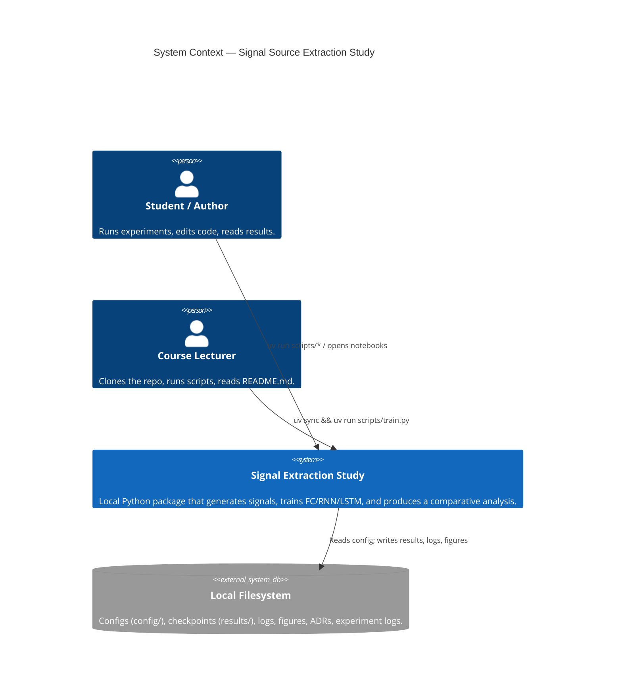
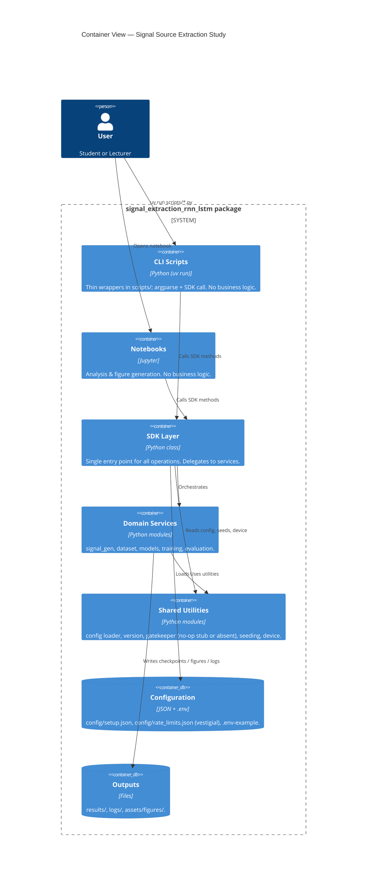
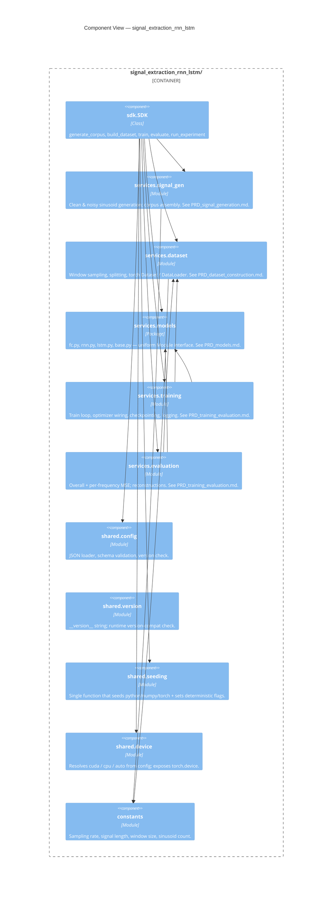
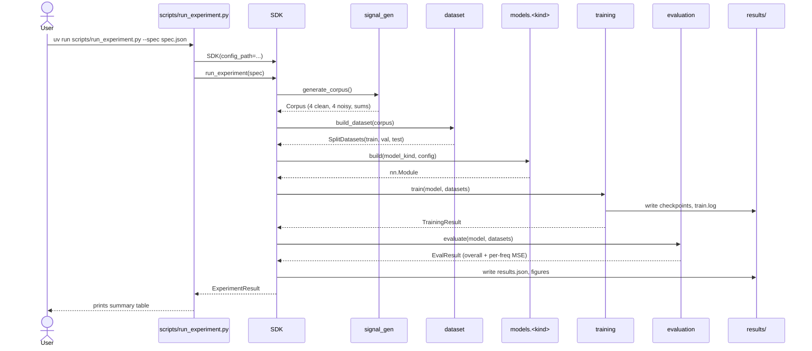
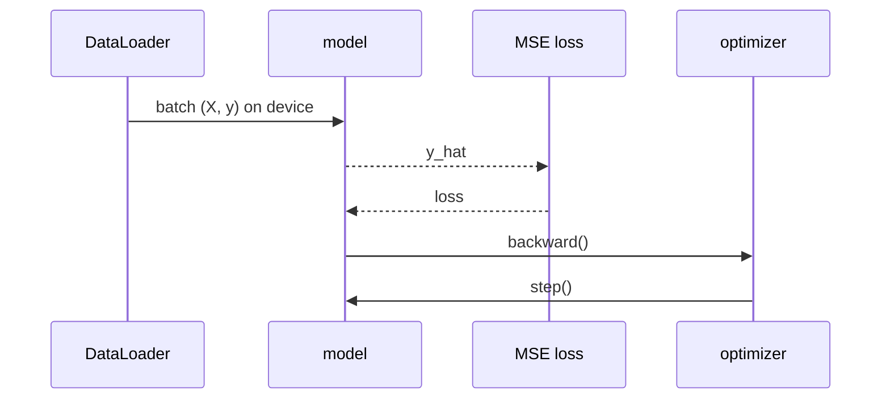
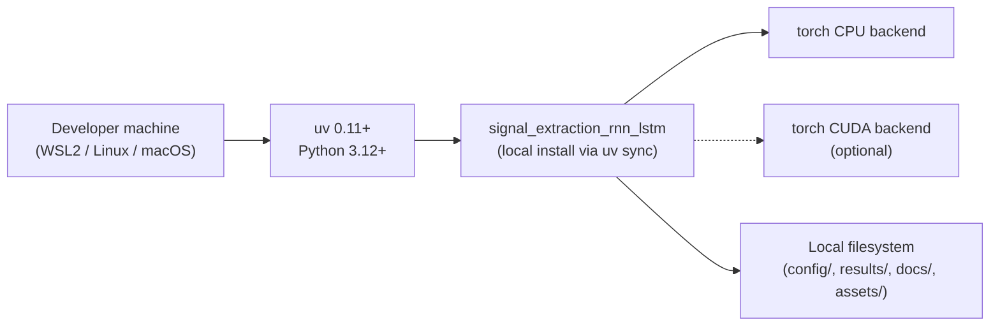

# PLAN — Architecture & Design

> **Document version:** 1.02
> **Status:** Approved 2026-05-01 (v1.02 sweep: § 8 LOC ceilings, § 9 config schema, § 11 device, § 13 ADR index, § 15 cross-refs; M0 ADRs 001, 002, 004, 005, 009, 012, 014, 015 written).
> **Companion:** `docs/PRD.md` v1.01, `HOMEWORK_BRIEF.md`, `SOFTWARE_PROJECT_GUIDELINES.md`, dedicated PRDs in `docs/PRD_*.md`, ADRs in `docs/adr/`.
> **Scope:** This is the architecture document. It describes the system's structure, contracts, and runtime view. It does **not** restate decisions — every decision lives in its own ADR under `docs/adr/`. When this document references a decision, it links to the ADR and stops.

---

## 1. Purpose & Reading Guide

| You want to know… | Read this |
| --- | --- |
| What the project must do and why | `docs/PRD.md` |
| **How** the project is structured (this doc) | `docs/PLAN.md` |
| Why a specific design choice was made | `docs/adr/ADR-NNN-*.md` |
| How a specific subsystem works in detail | `docs/PRD_<subsystem>.md` |
| What was actually run, with numbers | `docs/experiments/EXP-NNN-*.md` |
| What is left to do, who's doing it | `docs/TODO.md` |

The four dedicated PRDs are the source of truth for their respective subsystems:

- `PRD_signal_generation.md` — base & noisy sinusoids, composite signals, the 10-vector corpus.
- `PRD_dataset_construction.md` — window sampling, splits, tensor contracts.
- `PRD_models.md` — FC, RNN, LSTM definitions and the selector-broadcast input scheme.
- `PRD_training_evaluation.md` — training loop, checkpointing, evaluation metrics, sensitivity grid.

This PLAN says how those subsystems compose; the PRDs say what each one is.

---

## 2. Quality Attributes Driving the Architecture

The design is shaped by these forces, in priority order (carried over from PRD.md § 3.1):

1. **Comparative clarity** — FC / RNN / LSTM must be swappable behind a single interface so that comparisons are apples-to-apples.
2. **Reproducibility & determinism** (NFR-1, NFR-2) — fixed seeds, device-agnostic execution, locked dependencies.
3. **Engineering hygiene** (NFR-4 through NFR-8) — ≤ 150 LOC per file, ≥ 85% coverage, zero `ruff` violations, uv-only.
4. **SDK-first** (guidelines § 3.1) — every business operation is reachable through one class.
5. **Documentation density** — ADR per decision, file per experiment.
6. **Extensibility** — adding a fourth model or a fifth sinusoid must be local edits, not refactors.

---

## 3. C4 Level 1 — System Context



There are **no external systems** — no APIs, no databases, no cloud services. This is what makes the `ApiGatekeeper` requirement vacuously satisfied (`ADR-001-gatekeeper-na.md`, M0, written).

---

## 4. C4 Level 2 — Containers

The system is a single Python package (`signal_extraction_rnn_lstm`) with internal layers, plus a small set of entry-point surfaces.



**Key invariants:**
- The CLI and notebooks contain **only** argument parsing, formatting, and SDK invocations. Any logic beyond glue belongs in services.
- The SDK is the **only** import surface that external consumers (CLI, notebooks, tests, future GUI) are allowed to touch. Tests against services are unit tests; tests against the SDK are integration tests.
- The `gatekeeper` module contains no runtime behavior. Its physical absence is recorded in `ADR-012-gatekeeper-absent.md` (M0, written).

---

## 5. C4 Level 3 — Components (inside the package)



**Why this decomposition (briefly; full justification in ADR-009-component-decomposition.md, M0, written):**
- Models are a sub-package, not a single module, because each architecture is its own file (≤ 150 LOC budget) plus a tiny shared `base.py`.
- `seeding` and `device` are split because they have different invalidation triggers (seeding changes per run; device changes per host).
- The dataset module owns both the window sampler and the `torch.utils.data.Dataset` adapter; they are co-located because they share the same shape contract.

---

## 6. C4 Level 4 — Code

Code-level details (class hierarchies, exact method signatures, tensor shapes) are owned by the four dedicated PRDs. PLAN.md only fixes the **public** SDK contract; everything else is internal and may be revised as long as the SDK contract is preserved.

### 6.1 SDK public contract (illustrative — final signatures locked in `PRD_models.md` § *SDK surface*)

```python
class SDK:
    """
    Input:
        config_path (Path | None): JSON config file. Defaults to config/setup.json.
    Output:
        SDK instance exposing all project operations.
    Setup:
        seed (int | None): seed override; falls back to config.
        device (str | None): 'cuda' | 'cpu' | 'auto'; falls back to config.
    """
    def generate_corpus(self) -> Corpus: ...
    def build_dataset(self, corpus: Corpus) -> SplitDatasets: ...
    def train(self, model_kind: ModelKind, datasets: SplitDatasets) -> TrainingResult: ...
    # Public evaluate accepts a handle the SDK itself produced (TrainingResult)
    # or an opaque model_id string. It MUST NOT accept a raw nn.Module from
    # external callers — that would leak service-internal types across the SDK boundary.
    def evaluate(self, trained: TrainingResult | str, datasets: SplitDatasets) -> EvalResult: ...
    def run_experiment(self, spec: ExperimentSpec) -> ExperimentResult: ...
```

Internal service-to-service calls inside the package may pass `nn.Module` directly (e.g. `services.training` → `services.evaluation`); the restriction applies only to the SDK's public surface.

Every public class — including dataclasses like `Corpus`, `SplitDatasets`, `TrainingResult`, `EvalResult`, `ExperimentSpec`, `ExperimentResult` — uses the **Building Block docstring format** (§ 15.1 of the guidelines): `Input / Output / Setup` sections.

---

## 7. Data Flow & Sequences

### 7.1 End-to-end experiment flow



### 7.2 Per-batch training step



The per-step input shape contract differs by model:

| Model | Input tensor shape | Notes |
| --- | --- | --- |
| FC | `(B, 14)` | flat: 4-dim selector ⊕ 10-dim window |
| RNN | `(B, 10, 5)` | per-step: 1 sample ⊕ 4-dim broadcast selector |
| LSTM | `(B, 10, 5)` | identical to RNN |

The fact that RNN and LSTM share their shape contract is what makes the comparison fair (`ADR-003-selector-broadcast.md`, M0, written).

---

## 8. Module Layout & LOC Budget

Finalized layout (v1.02). All four dedicated PRDs are approved; LOC ceilings reflect observed module sizes plus headroom. Any post-M0 ceiling change requires an ADR.

```text
src/signal_extraction_rnn_lstm/
├── __init__.py                        # ~ 10 LOC — exports SDK, __version__
├── constants.py                       # ~ 30 LOC — sampling rate, window size, etc.
├── sdk/
│   ├── __init__.py                    # ~  5 LOC
│   └── sdk.py                         # ~120 LOC — SDK class, public API only
├── services/
│   ├── __init__.py                    # ~  5 LOC
│   ├── signal_gen.py                  # ~120 LOC — clean + noisy sinusoid + corpus
│   ├── dataset.py                     # ~100 LOC — window sampler + torch Dataset
│   ├── models/
│   │   ├── __init__.py                # ~ 30 LOC — model registry
│   │   ├── base.py                    # ~ 60 LOC — shared interface, shape checks
│   │   ├── fc.py                      # ~ 50 LOC
│   │   ├── rnn.py                     # ~ 50 LOC
│   │   └── lstm.py                    # ~ 50 LOC
│   ├── training.py                    # ~140 LOC — loop, checkpoint, logging
│   └── evaluation.py                  # ~130 LOC — overall & per-freq MSE
└── shared/
    ├── __init__.py                    # ~  5 LOC
    ├── config.py                      # ~ 90 LOC — JSON load + schema + version check + angle parser
    ├── version.py                     # ~  5 LOC — __version__ = "1.00"
    ├── seeding.py                     # ~ 40 LOC
    └── device.py                      # ~ 30 LOC
    # NOTE: no gatekeeper.py — see ADR-012 (module is absent, not stubbed).

scripts/
├── train.py                           # ~ 60 LOC — argparse → SDK.train()
├── run_experiment.py                  # ~ 60 LOC — argparse → SDK.run_experiment()
└── benchmark_device.py                # ~ 50 LOC — feeds EXP-001 / ADR-006

tests/
├── unit/
│   ├── test_signal_gen.py
│   ├── test_dataset.py
│   ├── test_models/
│   │   ├── test_fc.py
│   │   ├── test_rnn.py
│   │   └── test_lstm.py
│   ├── test_training.py
│   ├── test_evaluation.py
│   └── test_shared/
│       ├── test_config.py
│       ├── test_seeding.py
│       └── test_device.py
├── integration/
│   ├── test_sdk_smoke.py              # end-to-end on tiny corpus
│   └── test_reproducibility.py        # same seed → same output
└── conftest.py                        # shared fixtures
```

Every file (including test files) is under the 150-LOC limit. If any file approaches 130 LOC during implementation, an ADR is opened to plan the split before it crosses 150.

**Entry points policy.** There is **no `main.py` at the package root**. Console entry points are declared in `pyproject.toml` under `[project.scripts]`; user-facing CLIs live in `scripts/` as thin argparse wrappers that import and call the SDK. This avoids the conflict between "uv entry point" and the guidelines' prohibition on `python -m` invocation.

---

## 9. Configuration Architecture

```text
config/
├── setup.json            # version=1.00; signal, dataset, model, training params
└── rate_limits.json      # version=1.00; vestigial — kept per guidelines § 6.3
.env-example              # placeholders only (no secrets in code)
```

`setup.json` is hierarchical. **Angle convention:** every angle/phase field is a **string expression** in radians, parsed at load time by `shared/config.py`. Accepted tokens: numeric literals, `pi`, integer/decimal coefficients, `*`, `/`, parentheses (e.g. `"2*pi"`, `"3*pi/2"`, `"0.5"`). This convention applies uniformly to `phases_rad` and `noise.beta`; it is not used for non-angle numbers.

```json
{
  "version": "1.00",
  "runtime": {
    "device": "auto",
    "seed": 1337,
    "dataloader": { "num_workers": 0 }
  },
  "signal":  {
    "fs": 1000,
    "duration_s": 10,
    "frequencies_hz": [2, 10, 50, 200],
    "amplitudes": [1.0, 1.0, 1.0, 1.0],
    "phases_rad": ["0", "pi/2", "pi", "3*pi/2"],
    "noise": { "alpha": 0.05, "beta": "2*pi", "distribution": "gaussian" }
  },
  "dataset": { "window": 10, "n_train": 30000, "n_val": 3750, "n_test": 3750 },
  "model":   { "fc": { "hidden": [64, 64] }, "rnn": { "hidden": 64, "layers": 1 },
               "lstm": { "hidden": 64, "layers": 1 } },
  "training":{ "batch_size": 256, "epochs": 30, "optimizer": "adam", "lr": 1e-3,
               "scheduler": null, "early_stop_patience": 5 }
}
```

Notes on specific fields:

- `dataset` has no `split_strategy` or fraction fields. ADR-016 fixes a single strategy (random iid sampling on a stationary process); splits are defined by absolute counts (`n_train`, `n_val`, `n_test`) only.
- `signal.phases_rad` are **distributed across the unit circle** (`0`, `π/2`, `π`, `3π/2`). Synchronized zero-phase starts produce constructive/destructive-interference artifacts at `t = 0` that contaminate windows sampled near the start of the signal. This is recorded in `ADR-015-base-phase-distribution.md`.
- `signal.noise.beta = "2*pi"` matches HOMEWORK_BRIEF § 3.2 ("0 to 2π is more interesting").
- `runtime.dataloader.num_workers = 0` is intentional and load-bearing — see § 11.4 below.

The schema, version compatibility check, default-fallback policy, and the angle-expression parser are owned by `shared/config.py` and validated in unit tests. Any change to the schema bumps `setup.json` version and writes an ADR.

---

## 10. Deployment View



There is no remote runtime, no container image, no CI service in scope for v1.00. A local `scripts/check.sh` runs `ruff`, `pytest --cov`, and a file-size linter; it is the closest thing this project has to a CI pipeline. (Whether to add GitHub Actions is `ADR-010-ci-or-not.md`, deferred — write only if remote CI is added.)

---

## 11. Cross-Cutting Concerns

### 11.1 Determinism
Owned by `shared/seeding.py`. Sets `random.seed`, `numpy.random.seed`, `torch.manual_seed`, `torch.cuda.manual_seed_all`, and calls `torch.use_deterministic_algorithms(True)` where supported by the active backend. The seed is read from config (`runtime.seed`).

### 11.2 Logging
Standard `logging` to stdout + a per-run file under `results/<run_id>/train.log`. No structured logger framework in v1.00 — keeping the dependency surface minimal. (deferred: `ADR-011-logging-strategy.md`.)

### 11.3 Error model
Services raise plain `ValueError` / `TypeError` for contract violations and a small set of project-specific exceptions (e.g. `ConfigVersionMismatch`) defined in `shared/`. No silent failures; no broad `except Exception:` blocks.

### 11.4 Concurrency
Single-process, single-thread within the training loop. The corpus is small enough that the dataset is fully materialized in memory (verified by tests). DataLoader workers are explicitly fixed at **`num_workers=0`** to preserve determinism (NFR-1, NFR-2); this is configured in `setup.json` under `runtime.dataloader.num_workers`, not hard-coded. PyTorch's internal CPU threading is left at default for now; if it becomes a determinism issue, `torch.set_num_threads(1)` will be added under the same `runtime` section. (Guidelines § 14 is therefore minimally engaged.)

### 11.5 Device
All models and tensors honor the config field `runtime.device ∈ {"cpu", "cuda", "auto"}`. The value `"auto"` selects `cuda` if `torch.cuda.is_available()`, otherwise `cpu`. Device resolution lives in `shared/device.py` and is called once at SDK initialization; all downstream services receive a `torch.device` object. The reference device for benchmarks and the comparative study (EXP-001) will be locked in `ADR-006-reference-device.md` after the `EXP-001` smoke benchmark (`scripts/benchmark_device.py`).

### 11.6 Security
No secrets are needed. `.env-example` exists per guidelines § 6.4; `.env` is git-ignored.

---

## 12. Test Architecture

```text
unit tests       —> services in isolation; mocks only at infrastructure boundaries (filesystem)
integration      —> SDK end-to-end on a tiny corpus (~50 windows, 1 epoch) that runs in seconds
property tests   —> shape contracts on every model output; idempotency of seeding
```

The 85% coverage threshold is enforced in `pyproject.toml` (`fail_under = 85`). Coverage excludes `notebooks/`, `scripts/`, and `gui/` (none planned) per guidelines.

---

## 13. ADR Index

The granularity rule (per the lecturer's stated grading bias) is *over*-document, not *under*-document. ADRs are split into three categories: **M0 upfront** (all written during M0), **deferred** (written when the triggering work happens), and **folded** (decision consolidated into a PRD rather than a standalone ADR).

### 13.1 M0 upfront ADRs (all written)

| ADR | File | Topic |
| --- | --- | --- |
| ADR-001 | `ADR-001-gatekeeper-na.md` | `ApiGatekeeper` requirement vacuously satisfied — no external APIs. |
| ADR-002 | `ADR-002-pytorch.md` | Modeling framework: PyTorch. |
| ADR-003 | `ADR-003-selector-broadcast.md` | Selector-broadcast scheme for RNN/LSTM (`[x_t, C]` per step). |
| ADR-004 | `ADR-004-dataset-size.md` | Dataset size: 30 000 / 3 750 / 3 750 (80/10/10). |
| ADR-005 | `ADR-005-noise-distribution.md` | Noise distribution: Gaussian, α = 0.05, β = 2π, per-sample. |
| ADR-009 | `ADR-009-component-decomposition.md` | Component decomposition: SDK / services / shared / constants. |
| ADR-012 | `ADR-012-gatekeeper-absent.md` | `gatekeeper.py` is **absent**, not stubbed. |
| ADR-014 | `ADR-014-results-layout.md` | Results layout: `results/<utc_timestamp>__<model_kind>__<seed>/`. |
| ADR-015 | `ADR-015-base-phase-distribution.md` | Base-phase distribution: `[0, π/2, π, 3π/2]`. |
| ADR-016 | `ADR-016-random-sampling-stationary.md` | Random t₀ sampling on a stationary process (no disjoint splits). |
| ADR-017 | `ADR-017-dataloader-shuffling.md` | DataLoader shuffling: train shuffles each epoch; val/test deterministic. |

### 13.2 Deferred ADRs (write when triggered)

| ADR | Topic | Trigger |
| --- | --- | --- |
| ADR-006 | Reference device (CPU vs CUDA). | Write **after** `EXP-001` smoke benchmark completes (M3+M4). |
| ADR-007 | Number of seeds per (model, freq) cell. | Write when the experiment matrix is finalized (M5). |
| ADR-010 | CI: local script vs GitHub Actions. | Write only if remote CI is added. |
| ADR-011 | Logging strategy. | Write if the stdout-plus-file approach is replaced. |
| ADR-013 | Config override policy (`--override key=value`). | Write if CLI override usage becomes non-trivial (post-M0). |
| ADR-018 | Input normalization. | Conditional: open if `EXP-001` shows optimizer instability traceable to input scale. |
| ADR-019 | Initialization strategy. | Conditional: open if `EXP-001` shows NaN losses or catastrophic RNN divergence. |

### 13.3 Folded into a PRD (no separate ADR)

- **ADR-008 (frequency selection)** — folded inline into `PRD_signal_generation.md § 4`. The frequency set `[2, 10, 50, 200] Hz` is signal-design, not architectural; it has no impact on the SDK contract or component boundaries. If a future ablation changes the sinusoid count (>4), an ADR opens at that time.

Additional ADRs will be added as the design surfaces new decisions; the index above is the floor, not the ceiling.

---

## 14. Resolutions of Open Architectural Questions (locked 2026-04-30)

1. **`gatekeeper.py` presence — RESOLVED: absent.** The module is not created. The ADR (`ADR-012-gatekeeper-absent.md`) records the decision and points readers at `ADR-001-apigatekeeper-na.md` for the underlying rationale.
2. **Model factories location — RESOLVED:** registry lives in `services/models/__init__.py`. The SDK calls `models.build(kind, config)` and never imports concrete model classes directly.
3. **Config overrides — RESOLVED:** CLI scripts accept `--override key=value` (repeatable). `ADR-013-config-override-policy.md` is **deferred** until usage demands the formality (post-M0).
4. **Result directory layout — RESOLVED:** `results/<utc_timestamp>__<model_kind>__<seed>/` containing `results.json`, `train.log`, `checkpoint.pt`, `figures/`. Recorded in `ADR-014-results-layout.md`.
5. **ADR numbering — RESOLVED:** **global** numbering across the entire project. Dedicated PRDs cite ADRs by ID; they do not maintain their own numbering ranges.

---

## 15. Cross-references to Companion PRDs

The four dedicated PRDs are the authoritative sources for their subsystems. Key sections cited from this document:

- `PRD_signal_generation.md § 4` — frequency selection rationale; ADR-008 consolidated here (see § 13.3).
- `PRD_dataset_construction.md § 5` — random-sampling split strategy; full reasoning behind ADR-016.
- `PRD_models.md § 5` — per-architecture decisions (FC, RNN, LSTM) and the selector-broadcast mechanics.
- `PRD_training_evaluation.md § 8` — thesis evaluation protocol: the bridge from per-frequency MSE to the README "Thesis evaluation" section.

## 16. References

- `docs/PRD.md` v1.01.
- `HOMEWORK_BRIEF.md` (task contract).
- `SOFTWARE_PROJECT_GUIDELINES.md` (engineering ruleset; see in particular §§ 1, 2.2, 3, 4, 5, 6, 13, 15).
- `docs/PRD_signal_generation.md` v1.01, `docs/PRD_dataset_construction.md` v1.01, `docs/PRD_models.md` v1.01, `docs/PRD_training_evaluation.md` v1.01.
- `docs/adr/` — see § 13 for the full ADR index.
